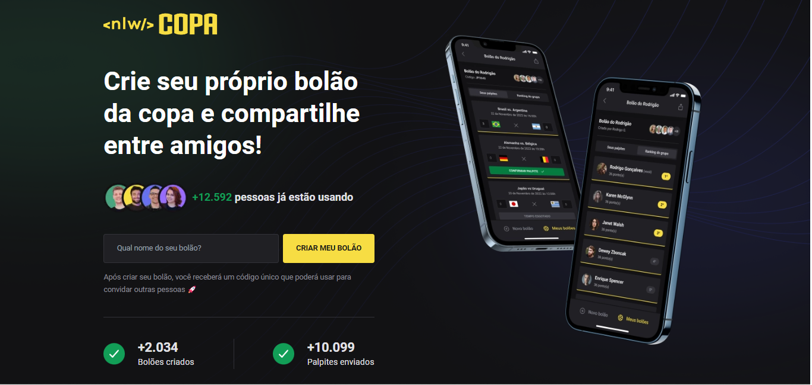

# NLW Copa
 É um evento de devs realizado pela [Rocketseat](https://www.rocketseat.com.br/), no qual, são 5 dias de bastante aprendizados sobre programação e como ser um profissional de qualidade para o mercado de tecnologia.
 Nesta edição é criado um aplicação de Bolões para jogos da Copa do mundo, ainda mais um usuário pode criar um bolão e fazer palpites dos jogos em vários bolões que está inserido.Assim, um usuário pode criar um bolão pela a WEB e no app mobile, mas a parte de fazer palpites dos jogos somente no app mobile.
 NEVER STOP LEARNING

## Tecnologias utilizadas no Back-end
- Nodejs
- TypeScript
- SQLite
- Prisma 

## Tecnologias utilizadas no Front-end
- React e TailwindCSS
- React Native e Expo

## Funcionalidades da WEB
- Criar um bolão
- Quantidade de bolões e palpites enviados

## Funcionalidades do Mobile
- Signin via gmail
- Criar bolão
- Entrar em um bolão via código
- Fazer palpites dos jogos

## WEB 

### Tela Home

  

